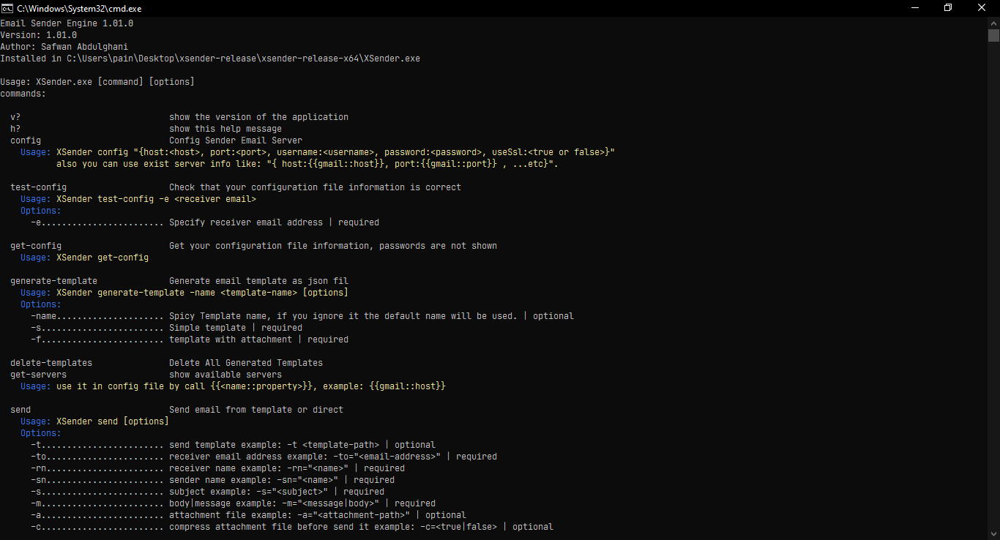

# XEmail Sender Engine
`version: "1.0.0 BETA (2022-02-13)"`


```textmate
 simple console application to send email.
```

# Screenshot


---
# Installation
Just download the file and run it from commandLine.
   * window x64: [download](./release/xsender-release-x64.zip)
   * window x86: [download](./release/xsender-release-x86.zip)

# usage
```textmate
$ xsender [options]
```

#commands

* `help`
```textmate
$ xsender ? | h? | -h | --help | help

  -h | --help | help
    show help message
```
---
* `version`
```textmate
$ xsender -v | --version | v? | version?

  -v | --version | version?
    show application version
```
---
* `config`
```textmate
$ xsender -c | --config | config

  -c | --config | config
    setup configuration of xsender application and save it to encrypted file.

    usage:
      $ xsender -c | --config | config [options]
      $ xsender -c "{host:<host>, port:<port>, username:<username>, password:<password>, useSsl:<true or false>}"
      -> cofig data must be json format.
      -> ssl enabled by default.

    example:
      $ xsender -c "{host:localhost, port:555, username:john@mail.com, password:abc1234}"
```
---
* `test-config`
```textmate
$ xsender -t | --test | test-config

  -t | --test | test-config
    test configuration of xsender

    usage:
      $ xsender -t | --test | test-config [options]
      $ xsender -t "{host:<host>, port:<port>, username:<username>, password:<password>, useSsl:<true or false>}"

    options:
      -e <email>
      -> email address to send a test message to it.

    example:
      $ xsender -t -e "john@mail.com"

    # result:
      -> Correct if test email is sent.
      -> Incorrect if test email is not sent.
```
---
* `get-config`
```textmate
$ xsender get-config
   get-config
    show configuration of xsender as json format and hide password.

    usage:
      $ xsender get-config
```
---
* `get-servers list`
```textmate
$ xsender get-servers

   get-servers
     show list of supported email servers.

   usage:
     $ xsender get-servers
```
---
* `send`
```textmate
$ xsender --s | --send | send [options]

  -s | --send | send
    send email.

    usage:
    -> template mode:
      $ xsender --s | --send | send -t <template>
    -> direct mode:
      $ xsender --s | --send | send -r="<receiver-email>" -rn="<receiver-name>" -sn="<sender-name>" -s="<subject>" -m="<message>" -a="<attachment-path>" -c=<true|false>

    options:
      -t        send template example: -t <template-path> | optional
      -r        receiver email address example: -r=<email-address> | required
      -rn       receiver name example: -n=<name> | required
      -sn       sender name example: -n=<name> | required
      -s        subject example: -s="<subject>" | required
      -m        body|message example: -m="<message|body>" | required
      -a        attachment file example: -a="<attachment-path>" | optional
      -c        compress attachment file before send it example: -c=<true|false> | optional

    example:
      $ xsender send -t template\demo.json
      $ xsender send  -r="john@mail.com" -rn="someone" -sn="someone" -s="demo subject" -m="demo message text" -a="c:\demo.pdf" -c=true

```
---
* `generate-template`
```textmate
$ xsender -g | --generate | generate-template [options] <template-name>

  -g | --generate | generate-template [options] <template-name>
    generate template file into current directory\templates.

    usage:
      $ xsender -g | --generate | generate-template [options] <template-name>
      $ xsender -g | --generate | generate-template

    options:
      -name <template-name> | optional
      -> template name to generate.
      -> if not set, default template name will be used "template_timestamp".

    example:
      $ xsender -g -name demo
      $ xsender -g

    # result:
      -> name of generated template file.
```

---
* `delete-templates`
```textmate
$ xsender -d | --delete | delete-templates

  -d | --delete | delete-templates
    delete all templates in current directory\templates.

    usage:
      $ xsender -d | --delete | delete-templates

    example:
      $ xsender -d
```

